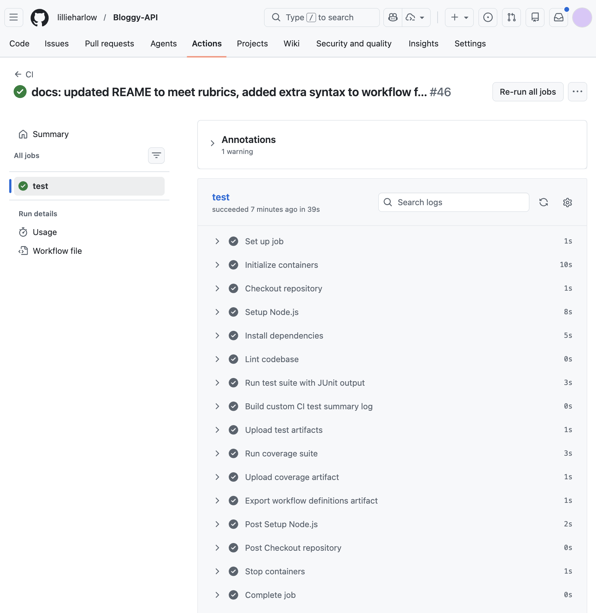
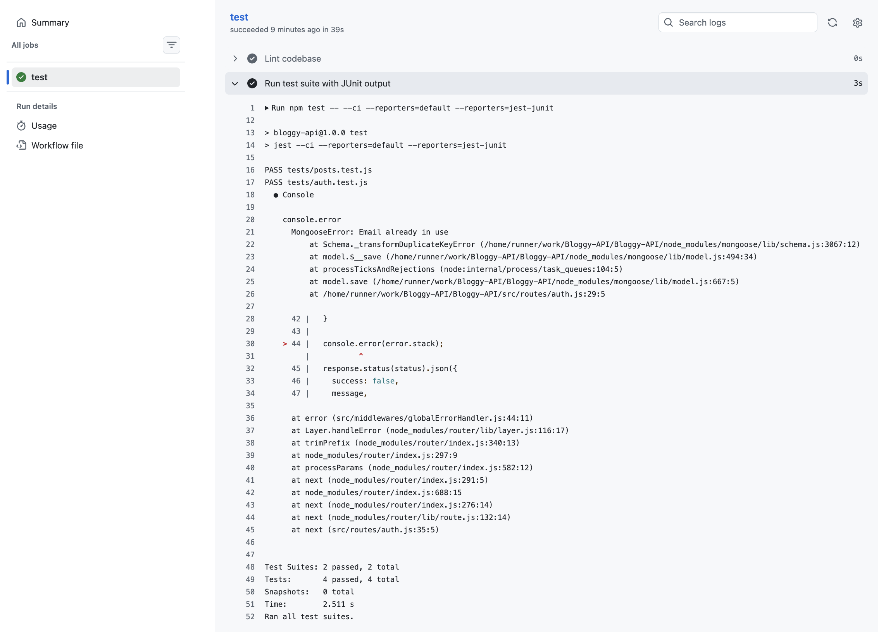
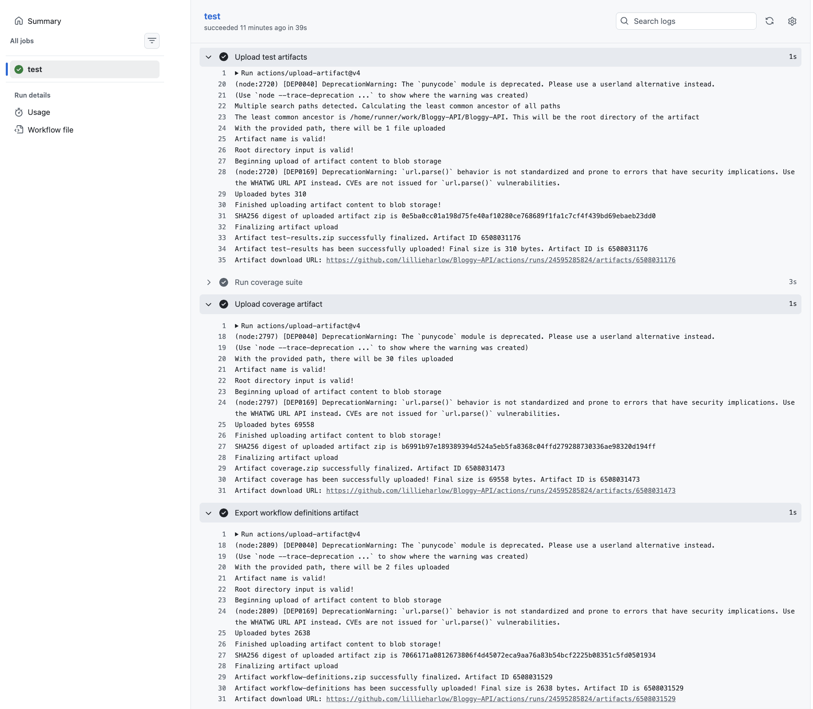
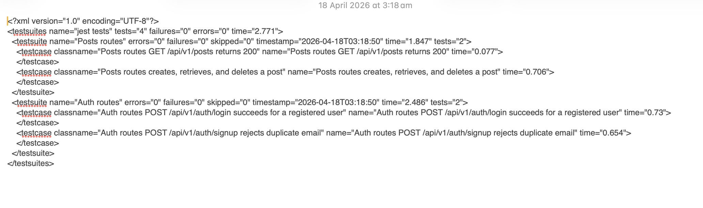
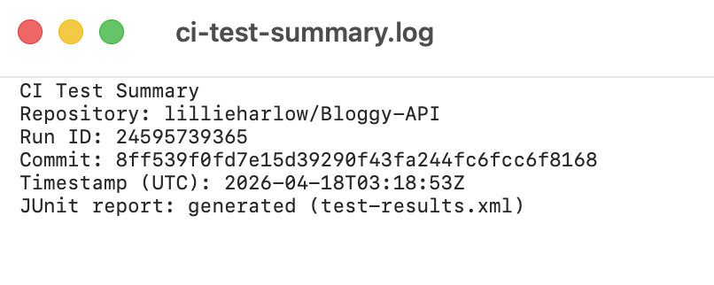
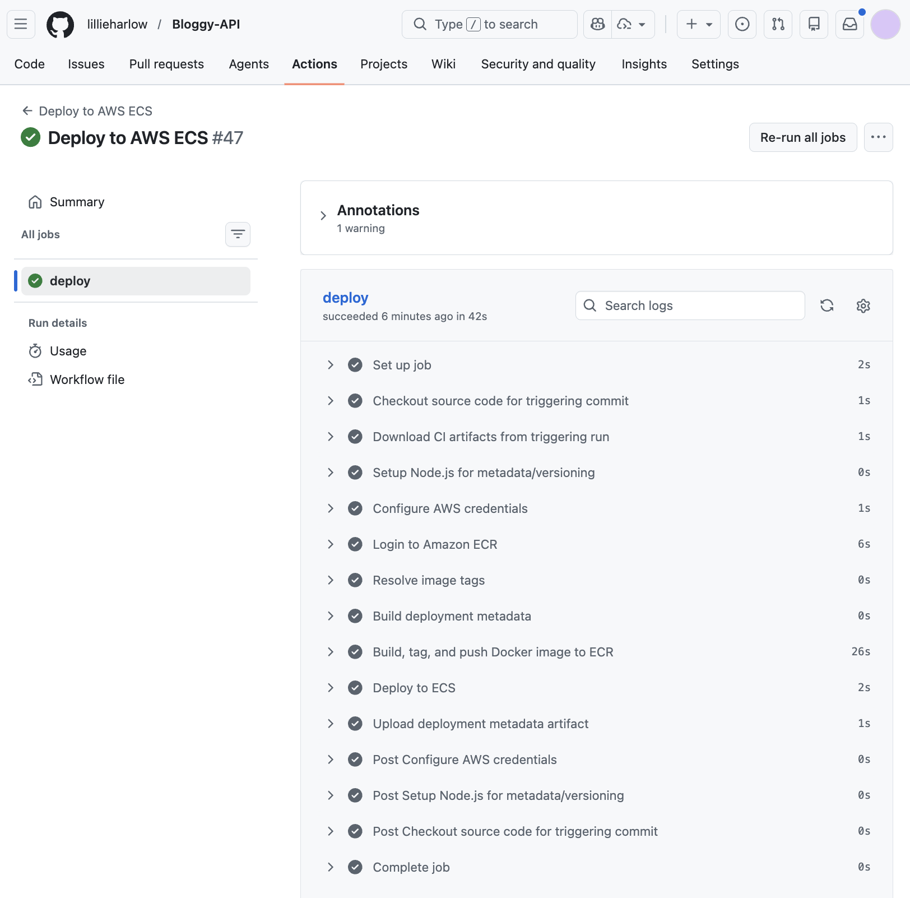
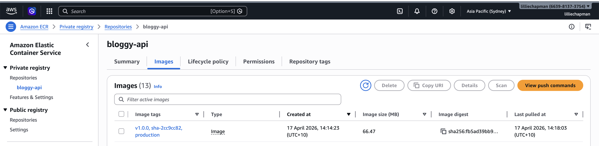
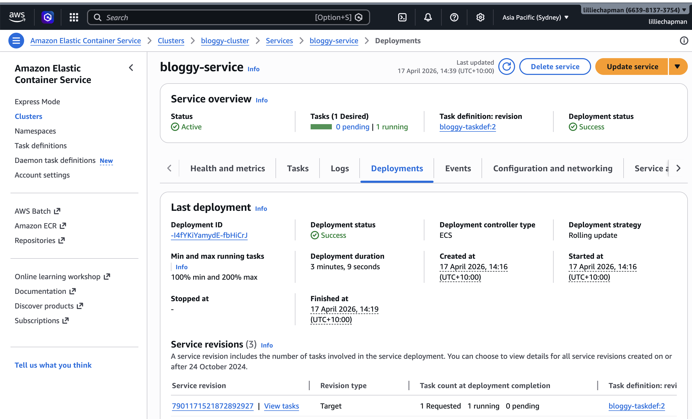
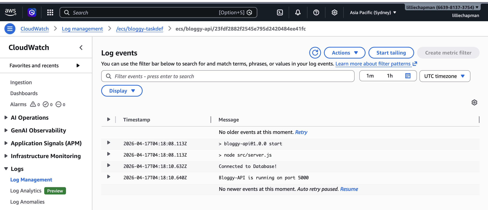
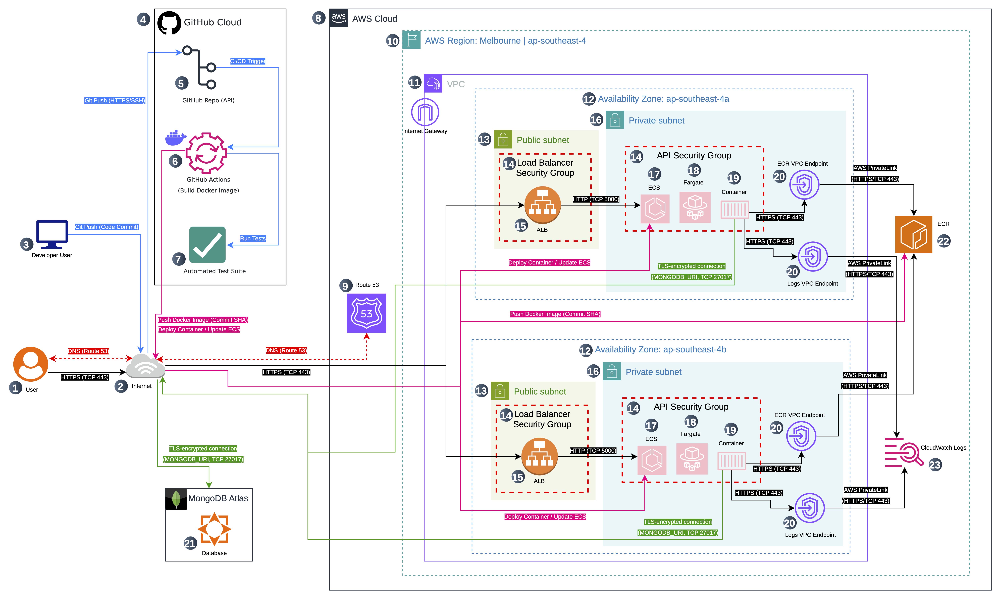

# Bloggy-API

A simple multi-user, headless Content Management System (CMS) backend built with Node.js, Express, and MongoDB.
**Bloggy-API is backend-only and does not include a UI.**

<hr>

## Table of Contents

- [Target Audience / User Stories](#target-audience--user-stories)
- [Accessing the API](#accessing-the-api)
- [Prerequisites](#prerequisites)
- [Quick Setup](#quick-setup)
- [Hardware Requirements](#hardware-requirements)
- [Dependencies](#dependencies)
- [Database Models](#database-models)
- [API Endpoints](#api-endpoints)
- [MVP Features](#mvp-features)
- [DevOps, CI/CD, and AWS Deployment](#devops-cicd-and-aws-deployment)
- [Screenshots](#screenshots)
- [Architecture Diagram](#architecture-diagram)
- [Justification](#justification)

## Target Audience / User Stories

- Developers: Building web or mobile apps that need a backend for blogging.
- Bloggers: Programmatically managing posts, comments, and user profiles.
- Startups and agencies: Creating tools for content management and social features.

## Accessing the API

Bloggy-API is a backend-only REST API; it does not include a web front end.  
**To interact with the API, use tools such as [Insomnia](https://insomnia.rest/), [Postman](https://www.postman.com/), or cURL.**

The deployed API can be accessed at: http://bloggy-alb-1205022993.ap-southeast-2.elb.amazonaws.com

See [API Endpoints](#api-endpoints) for a full list of supported routes.

## Prerequisites

- Node.js (recommended: v24 to match CI environment)
- npm
- A running MongoDB instance (local MongoDB or MongoDB Atlas)

## Quick Setup

1. Clone the repo:

```bash
git clone https://github.com/lillieharlow/Bloggy-API.git
cd Bloggy-API
```

2. Install dependencies:

```bash
npm install
```

3. Create a .env file from the example:

```bash
cp .env.example .env
# Fill out all environment variables as needed
```

4. Start the server:

```bash
npm start
```

5. Verify the API is running:

```bash
curl http://localhost:5000/
curl http://localhost:5000/health
```

You should receive JSON responses from both endpoints.

For live-reload during development, use:

```bash
npm run dev
```

Optional quality checks:

```bash
npm run lint
npm test
```

## Hardware Requirements

- Minimum: 1 CPU, 1 GB RAM
- Recommended: 2+ CPU, 2 GB RAM

## Dependencies

| Library            | Purpose                        |
| ------------------ | ------------------------------ |
| express            | Web framework                  |
| mongoose           | MongoDB ODM                    |
| jsonwebtoken       | JWT authentication             |
| bcryptjs           | Password hashing               |
| express-rate-limit | Rate limiting                  |
| helmet             | Security headers               |
| cors               | Cross-origin requests          |
| express-validator  | Request validation             |
| validator.js       | String validation/sanitization |

Dev dependencies: Jest, ESLint, Prettier, Supertest

## Database Models

Core models:

- User
- Post
- Comment

## API Endpoints

### App / System

| Method | Endpoint | Auth | Description |
| ------ | -------- | ---- | ----------- |
| GET    | /        | No   | API welcome/status message |
| GET    | /health  | No   | Database connection health |
| ALL    | *        | No   | Catch-all 404 handler for unknown routes |

### Auth (/api/v1/auth)

| Method | Endpoint            | Description    |
| ------ | ------------------- | -------------- |
| POST   | /api/v1/auth/signup | Create account |
| POST   | /api/v1/auth/login  | JWT login      |

### Profile (/api/v1/profile)

| Method | Endpoint            | Auth | Description           |
| ------ | ------------------- | ---- | --------------------- |
| GET    | /api/v1/profile/:id | No   | View profile (public) |
| POST   | /api/v1/profile     | Yes  | Create profile        |
| PATCH  | /api/v1/profile     | Yes  | Update profile        |
| DELETE | /api/v1/profile     | Yes  | Delete profile        |

### Posts (/api/v1/posts)

| Method | Endpoint                        | Auth | Description     |
| ------ | ------------------------------- | ---- | --------------- |
| GET    | /api/v1/posts                   | No   | List all posts  |
| GET    | /api/v1/posts/profile/:username | No   | Posts by user   |
| GET    | /api/v1/posts/:postId           | No   | Get single post |
| POST   | /api/v1/posts                   | Yes  | Create post     |
| PATCH  | /api/v1/posts/:postId           | Yes  | Update post     |
| DELETE | /api/v1/posts/:postId           | Yes  | Delete post     |

### Comments (/api/v1/posts/:postId/comments)

| Method | Endpoint                                  | Auth   | Description    |
| ------ | ----------------------------------------- | ------ | -------------- |
| GET    | /api/v1/posts/:postId/comments            | No     | List comments  |
| POST   | /api/v1/posts/:postId/comments            | No     | Add comment    |
| DELETE | /api/v1/posts/:postId/comments/:commentId | Yes | Delete comment |

## MVP Features

Public:

- Register and login
- View all posts and posts by user
- View user profile
- View and add comments

Authenticated:

- Create, update, and delete posts
- Create, update, and delete profiles
- Delete comments

## DevOps, CI/CD, and AWS Deployment

Bloggy-API uses GitHub Actions for automation and continuous delivery, deploying to AWS Elastic Container Registry (ECR) and running in AWS Elastic Container Service (ECS) Fargate.

### CI/CD Tools Used

- GitHub Actions (CI/CD for source code, tests, builds, and deployments)
- AWS ECR (stores container images, versioned deployments)
- AWS ECS Fargate (runs secure, scalable containers)
- AWS CloudWatch (centralized logging)
- AWS IAM and GitHub Secrets (secure credentials and access control)

### Why These Tools?

- GitHub Actions: Tight integration, easy artifact and log access, free for open source, supports DRY modular workflows and reusable secrets.
- AWS ECS and ECR: Secure and scalable container hosting and registry, with native AWS networking and IAM role support for least-privilege security.
- CloudWatch and IAM: Real-time log collection and granular security and access control.

### Workflows

1. Continuous Integration: [`.github/workflows/ci.yml`](.github/workflows/ci.yml)

Triggers:

- push to main
- pull_request
- weekly scheduled run (cron)
- manual dispatch (workflow_dispatch)

Steps:

- Checkout code
- Install dependencies
- Run lint and automated test suite (Jest)
- Generate formatted JUnit XML test report
- Build a custom CI test summary log file (`ci-test-summary.log`)
- Upload test report as a persistent artifact
- Run test coverage
- Upload coverage report as an artifact
- Export workflow definitions as downloadable artifacts

2. Continuous Deployment: [`.github/workflows/deploy.yml`](.github/workflows/deploy.yml)

Triggers:

- after CI passes on main
- manual dispatch (workflow_dispatch)
- scheduled deployment (cron)

Steps:

- Checkout the exact commit associated with the triggering event
- Download CI artifacts when deployment is triggered by a successful CI run
- Build one Docker image and push three deployment tags for revision tracking:
   - `production` (environment tag)
   - `v<package.json version>` (for example `v1.0.0`)
   - `sha-<short-commit-sha>` (8-character commit tag)
- Login and push the image tags to AWS ECR
- Trigger ECS service to pull and run latest image
- Upload deployment metadata as a persistent artifact

GitHub secrets used directly by workflow files:

| Secret Name           | Used By    | Purpose (do not commit these)          |
| --------------------- | ---------- | -------------------------------------- |
| AWS_ACCESS_KEY_ID     | deploy.yml | AWS user for ECR/ECS (least privilege) |
| AWS_SECRET_ACCESS_KEY | deploy.yml | AWS secret key for deployment          |
| AWS_REGION            | deploy.yml | AWS region (for example ap-southeast-2) |
| ECR_REGISTRY          | deploy.yml | URI of the AWS ECR registry            |
| ECR_REPOSITORY        | deploy.yml | ECR repository name                    |
| ECS_CLUSTER           | deploy.yml | ECS cluster name                       |
| ECS_SERVICE           | deploy.yml | ECS Fargate service name               |

Runtime secrets:

| Runtime Secret | Used By App | Purpose |
| -------------- | ----------- | ------- |
| MONGODB_URI    | server.js   | MongoDB Atlas connection string |
| JWT_SECRET     | auth/jwt middleware | Secret key for JWT signing and verification |

To set these: GitHub repository Settings > Secrets and variables > Actions.

### Environment Variables

A sample file is provided as .env.example. Do not commit real secrets.

```env
PORT=           # e.g. 7000 (if you want a different port for local use)
MONGODB_URI=    # Your full MongoDB Atlas connection URI
JWT_SECRET=     # Secret key for signing JWTs
MONGODB_TEST_URI= # Optional: separate URI used by local/CI test runs
```

Update .env with your real values for local development and testing.

### Testing and Logs

- CI runs tests on every push, pull request, scheduled trigger, and manual dispatch.
- Test results are formatted and uploaded as artifacts (for example `test-results.xml`, `ci-test-summary.log`, and coverage reports).
- Full test logs can be downloaded from the GitHub Actions Artifacts section.

### Deployment Steps

1. Set all required GitHub secrets.
2. Push or merge changes to main, or trigger deployment manually.
3. CI workflow runs lint/tests/coverage and uploads artifacts.
4. Deploy workflow can reuse CI artifacts (when triggered by `workflow_run`), builds and pushes Docker tags to ECR, then forces ECS redeployment.
5. Scheduled/manual deploy runs are allowed by workflow rules (even without a fresh CI run).
6. API logs are collected in AWS CloudWatch.

## Screenshots

Include these screenshots in order:

1. Successful CI workflow run: shows test job and artifact upload
   

2. Successful test run: shows all test run and pass
   

3. CI artifact download: shows workflow artifacts
   
   
   

4. Successful Deploy workflow run: shows CI artifact download (workflow_run), ECR push, ECS update, and `deployment-metadata` artifact upload
   

5. AWS ECR UI: shows latest image tag
   

6. AWS ECS Service UI: shows updated deployment
   

7. CloudWatch logs: for ECS task
   

## Architecture Diagram



### Justification

GitHub Actions: natively integrated with GitHub, supports reusable workflows and secrets out of the box, and keeps CI logs and artifacts in one place.

AWS ECS Fargate with ECR: reduces infrastructure management, improves security through IAM role-based access, and supports scalable container deployments with lower operational overhead.

AWS CloudWatch: integrates directly with ECS, simplifies troubleshooting during deployments, and keeps runtime logs centralised.

MongoDB Atlas: Free cloud-hosted database service, secure (TLS-encrypted) connection with AWS ECS containers.

This stack aligns with project goals: automated testing, persistent build and test artifacts, secure secret handling, and repeatable production deployment.