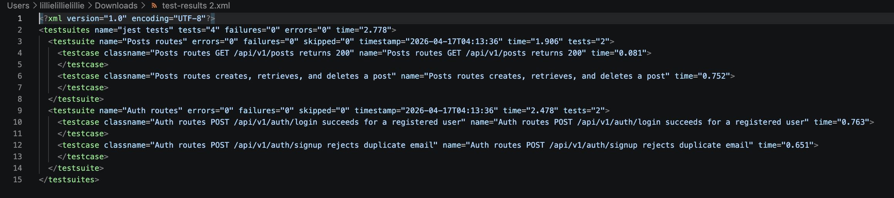

# Bloggy-API

A simple multi-user, headless Content Management System (CMS) backend built with Node.js, Express, and MongoDB. Bloggy-API enables authenticated users to manage their blog posts and profiles through a RESTful API.

Bloggy-API provides RESTful endpoints to create, read, update, and delete posts and comments with authentication.

Tech Stack: Node.js · Express · MongoDB Atlas · Mongoose · JWT

<hr>

## Table of Contents

- [Target Audience / User Stories](#target-audience--user-stories)
- [Quick Setup](#quick-setup)
- [Hardware Requirements](#hardware-requirements)
- [Dependencies](#dependencies)
- [Database Models](#database-models)
- [API Endpoints](#api-endpoints)
- [MVP Features](#mvp-features)
- [DevOps, CI/CD, and AWS Deployment](#devops-cicd-and-aws-deployment)
- [Screenshots](#screenshots)
- [Architecture Diagram](#architecture-diagram)
- [Justification](#justification)

## Target Audience / User Stories

- Developers: Building web or mobile apps that need a backend for blogging.
- Bloggers: Programmatically managing posts, comments, and user profiles.
- Startups and agencies: Creating tools for content management and social features.

## Quick Setup

1. Clone the repo:

```bash
git clone https://github.com/lillieharlow/Bloggy-API.git
cd Bloggy-API
```

2. Install dependencies:

```bash
npm install
```

3. Create a .env file from the example:

```bash
cp .env.example .env
# Fill out all environment variables as needed
```

4. Start the server:

```bash
npm start
```

## Hardware Requirements

- Minimum: 1 CPU, 1 GB RAM
- Recommended: 2+ CPU, 2 GB RAM

## Dependencies

| Library            | Purpose                        |
| ------------------ | ------------------------------ |
| express            | Web framework                  |
| mongoose           | MongoDB ODM                    |
| jsonwebtoken       | JWT authentication             |
| bcryptjs           | Password hashing               |
| express-rate-limit | Rate limiting                  |
| helmet             | Security headers               |
| cors               | Cross-origin requests          |
| express-validator  | Request validation             |
| validator.js       | String validation/sanitization |

Dev dependencies: Jest, ESLint, Prettier, Supertest

## Database Models

Core models:

- User
- Post
- Comment

## API Endpoints

### Auth (/api/v1/auth)

| Method | Endpoint            | Description    |
| ------ | ------------------- | -------------- |
| POST   | /api/v1/auth/signup | Create account |
| POST   | /api/v1/auth/login  | JWT login      |

### Profile (/api/v1/profile)

| Method | Endpoint            | Auth | Description           |
| ------ | ------------------- | ---- | --------------------- |
| GET    | /api/v1/profile/:id | No   | View profile (public) |
| POST   | /api/v1/profile     | Yes  | Create profile        |
| PATCH  | /api/v1/profile     | Yes  | Update profile        |
| DELETE | /api/v1/profile     | Yes  | Delete profile        |

### Posts (/api/v1/posts)

| Method | Endpoint                        | Auth | Description     |
| ------ | ------------------------------- | ---- | --------------- |
| GET    | /api/v1/posts                   | No   | List all posts  |
| GET    | /api/v1/posts/profile/:username | No   | Posts by user   |
| GET    | /api/v1/posts/:postId           | No   | Get single post |
| POST   | /api/v1/posts                   | Yes  | Create post     |
| PATCH  | /api/v1/posts/:postId           | Yes  | Update post     |
| DELETE | /api/v1/posts/:postId           | Yes  | Delete post     |

### Comments (/api/v1/posts/:postId/comments)

| Method | Endpoint                                  | Auth   | Description    |
| ------ | ----------------------------------------- | ------ | -------------- |
| GET    | /api/v1/posts/:postId/comments            | No     | List comments  |
| POST   | /api/v1/posts/:postId/comments            | No     | Add comment    |
| DELETE | /api/v1/posts/:postId/comments/:commentId | Author | Delete comment |

## MVP Features

Public:

- Register and login
- View all posts and posts by user
- View user profile
- View and add comments

Authenticated:

- Create, update, and delete posts
- Create, update, and delete profiles
- Delete comments (if author)

## DevOps, CI/CD, and AWS Deployment

Bloggy-API uses GitHub Actions for automation and continuous delivery, deploying to AWS Elastic Container Registry (ECR) and running in AWS Elastic Container Service (ECS) Fargate.

### CI/CD Tools Used

- GitHub Actions (CI/CD for source code, tests, builds, and deployments)
- AWS ECR (stores container images, versioned deployments)
- AWS ECS Fargate (runs secure, scalable containers)
- AWS CloudWatch (centralized logging)
- AWS IAM and GitHub Secrets (secure credentials and access control)

### Why These Tools?

- GitHub Actions: Tight integration, easy artifact and log access, free for open source, supports DRY modular workflows and reusable secrets.
- AWS ECS and ECR: Secure and scalable container hosting and registry, with native AWS networking and IAM role support for least-privilege security.
- CloudWatch and IAM: Real-time log collection and granular security and access control.

### Workflows

1. Continuous Integration (ci.yml)

Triggers:

- push to main
- pull_request
- weekly scheduled run (cron)

Steps:

- Checkout code
- Install dependencies
- Run lint and automated test suite (npm test)
- Generate formatted JUnit XML test report
- Upload report as a persistent artifact

2. Continuous Deployment (deploy.yml)

Triggers:

- after CI passes on main
- manual dispatch (workflow_dispatch)
- scheduled deployment (cron)

Steps:

- Build Docker image
- Login and push image to AWS ECR
- Trigger ECS service to pull and run latest image

Both workflows require GitHub secrets for AWS and app credentials:

| Secret Name           | Purpose (do not commit these)           |
| --------------------- | --------------------------------------- |
| AWS_ACCESS_KEY_ID     | AWS user for ECR/ECS (least privilege)  |
| AWS_SECRET_ACCESS_KEY | AWS secret key for deployment           |
| AWS_REGION            | AWS region (for example ap-southeast-2) |
| ECR_REGISTRY          | URI of the AWS ECR repository           |
| ECS_CLUSTER           | ECS cluster name                        |
| ECS_SERVICE           | ECS Fargate service name                |
| MONGODB_URI           | MongoDB Atlas connection string |
| JWT_SECRET            | Secret key for JWT auth                 |

To set these: GitHub repository Settings > Secrets and variables > Actions.

### Environment Variables

A sample file is provided as .env.example. Do not commit real secrets.

```env
PORT=           # e.g. 7000
MONGODB_URI=    # Your full MongoDB Atlas connection URI
JWT_SECRET=     # Secret key for signing JWTs
```

Update .env with your real values for local development and testing.

### Deployment Workflow (deploy.yml)

Deployment workflow: [`.github/workflows/deploy.yml`](.github/workflows/deploy.yml).

This workflow:
- Runs automatically after successful CI on the main branch, on manual dispatch, or on a scheduled basis.
- Builds and tags a new Docker image for Bloggy-API.
- Pushes the image to AWS ECR.
- Updates the running ECS service to deploy the latest image version.

### Testing and Logs

- CI runs tests on every push, pull request, and scheduled trigger.
- Test results are formatted and uploaded as an artifact (for example test-results.xml).
- Full test logs can be downloaded from the GitHub Actions Artifacts section.

### Deployment Steps

1. Set all required GitHub secrets.
2. Push or merge changes to main, or trigger deployment manually.
3. Actions build and test, then deploy to AWS if checks pass.
4. ECS pulls the correct version from ECR and updates running containers.
5. API logs are collected in AWS CloudWatch.

## Screenshots

Include these screenshots in order:

1. Successful CI workflow run: shows test job and artifact upload
   

2. Successful test run: shows all test run and pass
   

3. Artifact download pane: shows test-results.xml
   
   

4. Successful Deploy workflow run: shows ECR push and ECS update
   

5. AWS ECR UI: shows latest image tag
   

6. AWS ECS Service UI: shows updated deployment
   

7. CloudWatch logs: for ECS task
   

## Architecture Diagram


### Justification

GitHub Actions: natively integrated with GitHub, supports reusable workflows and secrets out of the box, and keeps CI logs and artifacts in one place.

AWS ECS Fargate with ECR: reduces infrastructure management, improves security through IAM role-based access, and supports scalable container deployments with lower operational overhead.

AWS CloudWatch: integrates directly with ECS, simplifies troubleshooting during deployments, and keeps runtime logs centralised.

MongoDB Atlas: Free cloud-hosted database service, secure (TLS-encrypted) connection with AWS ECS containers.

This stack aligns with project goals: automated testing, persistent build and test artifacts, secure secret handling, and repeatable production deployment.